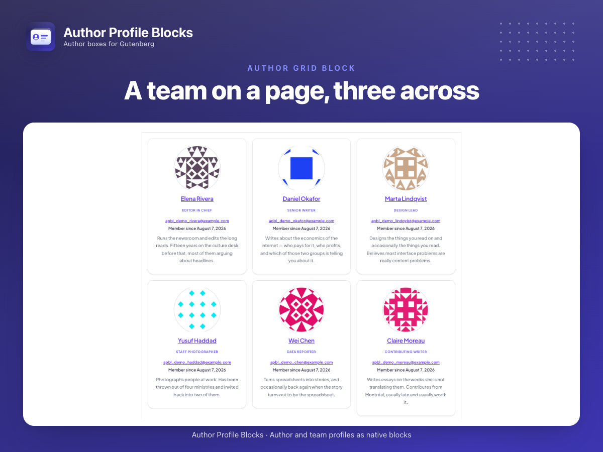
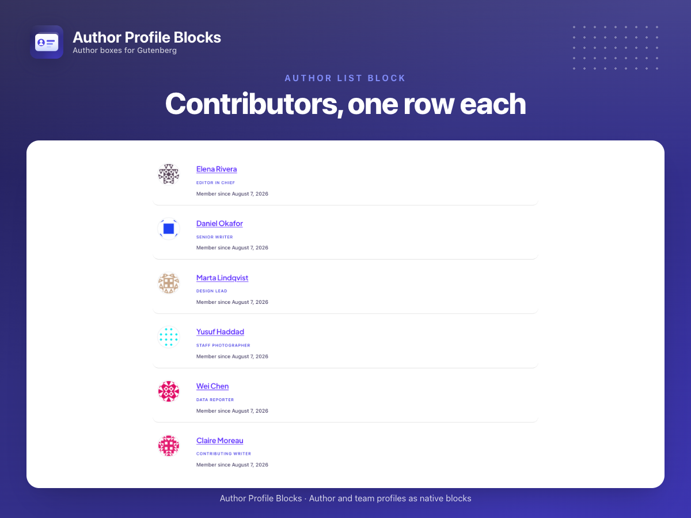
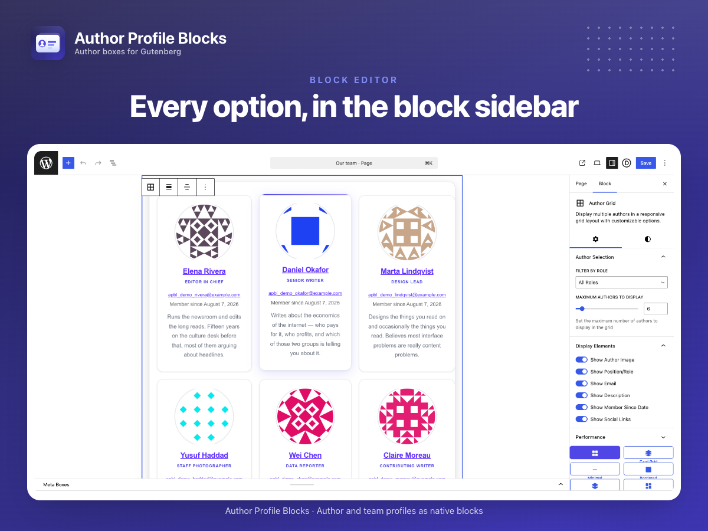
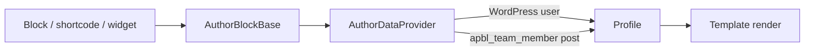

<div align="center">


# Author Profile Blocks

[](https://wordpress.org/plugins/author-profile-blocks/)
[](https://wordpress.org/plugins/author-profile-blocks/)
[](https://wordpress.org/plugins/author-profile-blocks/)
[](https://wordpress.org/plugins/author-profile-blocks/advanced/)
[](LICENSE)

Author profiles and team members as Gutenberg blocks — grid, carousel, list and single profile — with matching shortcodes and a classic widget.

</div>



## Quick Start

Install from the WordPress admin — **Plugins → Add New**, search for "Author Profile Blocks", then **Install Now** and **Activate**.

To run it from source instead:

```bash
git clone https://github.com/mralaminahamed/author-profile-blocks.git
cd author-profile-blocks
composer install
yarn install
yarn build
```

Minimum WordPress, PHP, and tested-up-to versions are shown in the badges above; `readme.txt` and the plugin header are the source of truth. Node.js 20+ is needed for development only.

## What It Does

Author boxes are usually welded to a theme: change the theme and the bios go with it. This plugin keeps them in content instead — blocks that read either a WordPress user or a team-member post, so the same profile can appear under an article, on an About page, and in a team grid without being written three times.

Every block has a shortcode twin and there is a classic widget, so the same profiles work in a block theme, a classic theme, and a page builder without a separate integration for each.

## What Ships

| Surface | Provided |
|---------|----------|
| Blocks | `author-profile`, `author-grid`, `author-list`, `author-carousel` |
| Shortcodes | `[apbl_profile]`, `[apbl_grid]`, `[apbl_list]`, `[apbl_carousel]` |
| Widget | Single profile for a classic sidebar |
| Post type | `apbl_team_member` — profiles for people who are not WordPress users |
| Taxonomy | `apbl_department` — groups team members, and filters the grid and list |
| REST | `author-profile-blocks/v1/settings` |

## Features

| Feature | Description |
|---------|-------------|
| Four blocks | Grid, carousel, list, and single profile |
| Users or posts | A profile resolves from a WordPress user or a team-member post, transparently |
| Shortcode twins | Every block has one, so classic themes and page builders are covered |
| Departments | Group and filter team members by taxonomy term |
| Templates | Render templates are overridable |
| Block supports | Colour, spacing, and typography through the standard block supports |
| REST | Settings read and written over `author-profile-blocks/v1` |

## Screenshots

<details>
<summary>View all screenshots</summary>

### Author profile


### Grid


### Carousel



### Settings



</details>

## Development

```bash
# JavaScript
yarn start                   # Watch mode
yarn build                   # Production build
yarn lint                    # Lint JS
yarn type                    # TypeScript check

# PHP
composer test                # PHPUnit
composer test:coverage       # With coverage
composer phpcs               # WordPress coding standards lint
composer phpcbf              # Auto-fix coding standards
composer phpstan             # Static analysis (level 8)
composer release             # Build, generate assets, package
```

Playwright specs live in `tests/pw/`.

## Architecture



PHP lives under the PSR-4 namespace `AuthorProfileBlocks\`:

```
author-profile-blocks.php    Bootstrap: constants, autoloader guard
includes/
  Blocks/                    Block registration and server-side render
  Services/                  Resolves a user or post to one profile shape
  Core/                      Bootstrap, assets, profile meta
  PostTypes/ Taxonomies/     apbl_team_member, apbl_department
  Shortcodes/                One per block, sharing the render path
  Widgets/                   Classic widget
  REST/ Admin/               Settings endpoints and screen
src/                         Block editor sources
build/                       Compiled blocks — generated, do not edit
templates/                   Overridable render templates
```

`AuthorBlockBase` is the seam worth knowing: block, shortcode and widget all render through it, so a markup change lands in all three at once rather than drifting between them.

## Extensibility

```php
// Change the resolved profile data
add_filter( 'author_profile_blocks_author_data', function( $data, $author_id ) {
    return $data;
}, 10, 2 );

// Adjust the query behind grid and list blocks
add_filter( 'author_profile_blocks_author_query_args', function( $args ) {
    return $args;
} );

// Filter the rendered markup
add_filter( 'author_profile_blocks_rendered_block', function( $html, $attributes ) {
    return $html;
}, 10, 2 );

// Register extra REST fields
add_filter( 'author_profile_blocks_register_rest_fields', function( $fields ) {
    return $fields;
} );
```

## Security

- Settings endpoints are capability-checked
- Profile output is escaped; attributes are sanitized
- No analytics, telemetry, or phone-home

Report vulnerabilities privately — see the [security policy](SECURITY.md).

## Changelog

The complete version history lives in [CHANGELOG.md](CHANGELOG.md), in [Keep a Changelog](https://keepachangelog.com/en/1.1.0/) format. [`readme.txt`](readme.txt) carries only the most recent releases, and is rendered on the [WordPress.org changelog page](https://wordpress.org/plugins/author-profile-blocks/#developers).

## Contributing

Bug reports, feature requests, and pull requests are welcome. Read the [contributing guide](CONTRIBUTING.md) before opening a pull request, and file issues on the [issue tracker](https://github.com/mralaminahamed/author-profile-blocks/issues).

## Maintainer

Al Amin Ahamed — [alaminahamed.com](https://alaminahamed.com) · [@mralaminahamed](https://github.com/mralaminahamed)

## License

[GPL-2.0-or-later](LICENSE)
